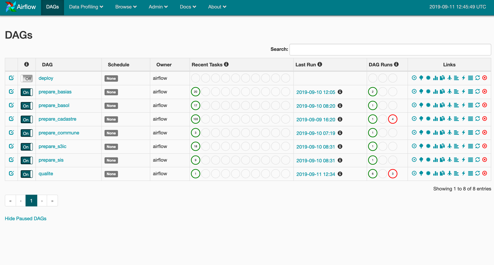

# kelrisks-data-preparation

Pipeline de préparation des données BASOL, BASIAS, SIS et S3IC pour l'application
Kelrisks

## Le projet

Kelrisks est un site du MTES qui permet d'évaluer simplement et rapidement le risque
de pollution d'un terrain.

* [Site web](https://kelrisks.beta.gouv.fr/#/)
* [Github du projet kelrisks](https://github.com/MTES-MCT/kelrisks)

## Les données

Pour ce faire, on exploite les bases de données
suivantes:

* SIS (Les secteurs d'information des sols)
* BASOL (Sites et sols pollués (SSP) ou potentiellement pollués appelant une action des pouvoirs publics, à titre préventif ou curatif)
* S3IC (base des installations classées pour la protection de l'environnement)
* BASIAS (Inventaire historique des sites industriels et activités de service)

Ces données sont disponibles en téléchargement via "clicodrome" sur les sites suivants
- [Géorisques](https://www.georisques.gouv.fr/) (SIS, BASIAS, S3IC)
- [installationsclassees.developpement-durable.gouv.fr](http://www.installationsclassees.developpement-durable.gouv.fr/) (S3IC)
- [basol.developpement-durable.gouv.fr](https://basol.developpement-durable.gouv.fr/) (Basol)


ne contiennent pas toutes les informations. Nous avons dû contacté le BRGM pour
pour accéder à des dumps plus complets. Ces dumps contiennent plus ou moins les mêmes
informations que celles contenues dans les pages détails dont on trouvera un
exemple ci-dessous pour chaque base

* [Page détail SIS](http://fiches-risques.brgm.fr/georisques/sis/91SIS00032)
* [Page détail Basol](https://basol.developpement-durable.gouv.fr/fiche.php?page=1&index_sp=07.0005)
* [Page détail Basias](http://fiches-risques.brgm.fr/georisques/basias-detaillee/IDF9100001)
* [Page détail S3IC](http://www.installationsclassees.developpement-durable.gouv.fr/rechercheIC.php?selectRegion=&selectDept=-1&champcommune=&champNomEtabl=&champActivitePrinc=-1&selectRegEtab=-1&champListeIC=&selectPrioriteNat=-1&selectRegSeveso=-1&selectIPPC=-1#)

On pourrait envisager de scraper ces pages détails pour l'ensemble
des sites. Cela permettrait d'automatiser les MAJ qui nécessite actuellement des échanges
par email avec le BRGM en attendant que les données soient effectivement ouvertes.

## Pile logiciel

* Docker
* Postgres
* [Apache Airflow](https://airflow.apache.org/)
* [data-preparation-plugin](https://github.com/MTES-MCT/data-preparation-plugin)
* [Embulk](https://www.embulk.org)


## Développement


### Prérequis

Vous devez avoir `docker` et `docker-compose` installés sur votre machine


### Mise en route

Le projet utilise `docker-compose` pour builder et démarrer les services. Deux fichiers compose
de dev sont possibles:

* `docker-compose.dev.airflow-only.yml`: permet de créer un serveur Airflow seul dans le cas où vous voulez utiliser une base Postgres existante qui tourne sur localhost.
* `docker-compose.dev.yml`: permet de créer un serveur Airflow *ET* une base de données Postgres.

Le projet est configuré par un fichier `.env` situé à la racine.
Ce fichier n'est pas versionné dans git car il dépend de chaque installation et expose des credentials.
Vous devez le créer et le renseigner en prenant le fichier `.env.model` pour modèle.

Une fois le fichier `.env` renseigné, vous pouvez builder et démarrer les services:

```
docker-compose -f docker-compose.dev.yml build
docker-compose -f docker-compose.dev.yml up
```

ou

```
docker-compose -f docker-compose.dev.airflow-only.yml build
docker-compose -f docker-compose.dev.airflow-only.yml
```

Visiter l'url `http://localhost:8080`, vous devez voir l'interface d'admin d'Airflow
avec différents pipelines de données:

* prepare_cadastre
* prepare_commune
* prepare_basias
* prepare_basol
* ...




## Ordre des pipelines
TODO

## Déploiement
TODO


